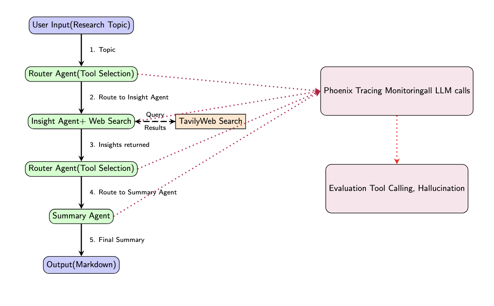

# LLM Evaluation with Phoenix

## Overview
This project presents an end-to-end research assistant system that retrieves relevant literature, generates structured summaries, and systematically evaluates LLM agent performance using Phoenix. The evaluation framework focuses on three critical dimensions: tool-calling reliability (router accuracy), hallucination detection, and summary factual accuracy, enabling transparent and traceable assessment of LLM behaviors in research workflows.

## Motivation
In research-oriented applications, accuracy and reliability are more critical than surface-level fluency. While LLMs can produce convincing outputs, unverified or hallucinated information poses significant risks in academic and analytical contexts. This project is motivated by the need for systematic and reproducible evaluation of LLM-based research assistants. By explicitly measuring tool-calling correctness, hallucination rates, and summary accuracy, the system allows users to assess the credibility of generated outputs and better understand the limitations of LLM agents in real research settings.

## Tech Stack
- LLM: OpenAI GPT-4o
- Framework: OpenAI Python SDK, LangChain (ChatOpenAI wrapper)
- Tracing: Phoenix AI (OpenTelemetry)
- Web Search: Tavily API
- UI: Streamlit
- Evaluation: Phoenix Evals (LLM-as-a-judge)

## Key Results
A. Output / Research Utility

* LLM-generated reports successfully summarize concept overviews, literature reviews, and potential research directions.

* Outputs in Markdown format are structured and ready for researcher use.

B. Evaluation / Reliability

* Aggregated span-level metrics over dozens of traces quantify tool-calling rates and hallucination rates, providing system-level insights.

* LLM-as-a-judge framework further evaluates output reliability.

* Full tracing ensures workflow transparency, making it possible to compare meaningfully.
  
## Figure

Figure 1. System Workflow

## Reflection
I learned that systematically evaluating LLM outputs is as important as developing the models themselves. Without proper tracing and evaluation, it is difficult for users, especially those new to the field, to independently assess the reliability of generated outputs.

This project highlighted the importance of designing research-assistant workflows that balance output utility, evaluation rigor, and transparency, enabling trustworthy and reproducible use of language models in real-world research applications.

## Demo
▶ **YouTube Demo (5 minutes)**  
[Project Demo - LLM Evaluation with Phoenix](https://youtu.be/UWhUrhJEork)

> This demo shows the end-to-end evaluation workflow and how Phoenix traces are used.

## Code
[GitHub Repository](https://github.com/yyunchieh/LLM-Evaluation-with-Phoenix)

