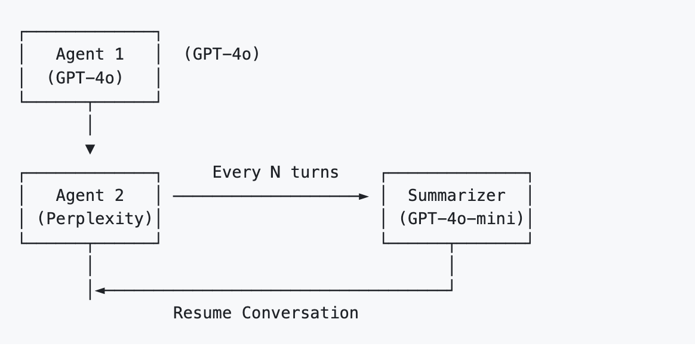
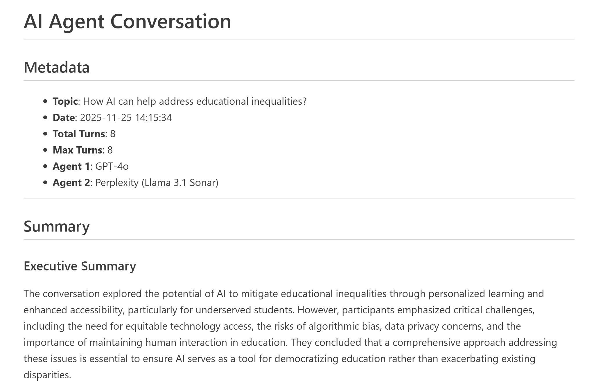

# Multi-Agent Conversation with Automated Summarization

## Overview
This project implements a LangGraph-based multi-agent system in which two large language models engage in structured discussions on an assigned topic, while a third agent periodically summarizes the conversation.
The system is designed to evaluate whether cross-model LLMs can communicate coherently and sustain role-based interactions, enabling simulations that resemble real-world discussions and supporting more advanced analytical and research-oriented applications.

## Motivation
This project was motivated by my collaboration with social science researchers exploring the use of LLMs for simulating human behavior, such as role-based discussions and collective reasoning.
To support this line of research, I designed a system that allows LLMs from different model families to interact within a shared conversational framework. Cross-model interaction is particularly valuable for simulation settings, as it introduces diversity in reasoning styles while maintaining structured communication. This project serves as a foundational infrastructure for future research in LLM-based social simulations and interdisciplinary analysis.

## System Design
* Three-Agent Architecture
    * Two conversational agents with distinct model configurations (GPT-4o and Perplexity Sonar)
    * One summarizer agent (GPT-4o-mini) responsible for periodic synthesis
* Turn-Based Coordination
    * Conversations proceed in fixed turns
    * Summaries are generated every N turns (default: 4) to maintain topical focus
* Configurable Workflow
    * Adjustable number of turns and summarization intervals
    * Easily extensible to additional agent roles or evaluation components

## Tech Stack & Methods
* Framework: LangGraph (state-based multi-agent orchestration)
* Models: GPT-4o, GPT-4o-mini, Perplexity Sonar
* Agent Design: Role-specific prompting and state transitions
* Output Format: Structured Markdown files with full dialogue logs and periodic summaries
* Application Focus: Social science simulations, educational discussions, and AI-assisted analysis
* Deployment: Production-ready LangGraph workflow

## Key Results
* Cross-model agents can maintain coherent and role-consistent discussions
* Periodic summarization improves conversation readability and topical coherence
* Role separation reduces redundancy and supports progressive idea development
* Markdown outputs facilitate review, sharing, and downstream qualitative analysis

## Figures

Figure 1. Architecture of the multi-agent system, showing agent roles and communication flow.

Figure 2. Partial output of the multi-agent system

[Download full multi-agent output PDF](Results/conversation_20251202_131412.md)

## Reflection
This project reinforced my understanding that effective multi-agent systems depend more on careful coordination, explicit role design, and structured information synthesis than on simply increasing the number of agents.

Drawing on my background in social science research, this project also demonstrates my ability to translate advanced AI techniques into real-world applications for social science problems. Through this work, my perspective has expanded beyond a single disciplinary lens. I now approach complex societal issues with a more interdisciplinary mindset that integrates both technical and social insights.

## Code
[GitHub Repository](https://github.com/yyunchieh/Multi-Agent-Conversation-with-Automated-Summarization)

